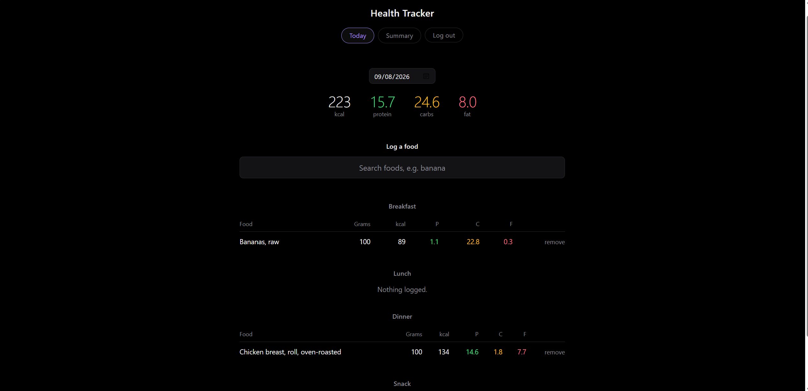
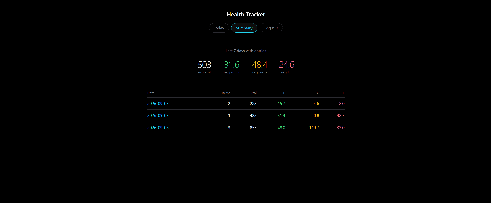

# Health Tracker

A web app for logging meals with real nutrition data and tracking daily macros.

**Live:** https://health-tracker-go3y.onrender.com
**Demo login:** `benwe` / `password`

The free Render instance sleeps after 15 minutes of inactivity, so the first load may take up to a minute.



## What it does

Search the USDA FoodData Central database, log a food by weight, and see calories and macros for the day broken out by meal. A summary view aggregates the last several days. Accounts are separate — each user sees only their own log.



## Stack

- **Backend:** Python, Flask
- **Database:** PostgreSQL in production, SQLite locally — raw SQL via `psycopg` and `sqlite3`, no ORM
- **Frontend:** Jinja templates, vanilla JavaScript
- **External API:** USDA FoodData Central
- **Hosting:** Render

## Design decisions

**Nutrition values are stored per 100g, not per serving.** Consumed amounts are computed at query time from the logged weight. Storing the derived value alongside the weight would let the two drift apart if an entry were edited, so the schema keeps one source of truth and the query does the arithmetic.

**Each entry snapshots the food's nutrition data rather than referencing a shared food table.** A log entry records what was true when it was logged, so a later revision to USDA's data can't retroactively change last week's numbers. It also avoids a lookup-or-insert on every write.

**Meal type is a column, not four tables.** Grouping happens at query time with a `CASE` expression in `ORDER BY`, so adding a category is a value change rather than a schema change.

**Dates are stored as ISO 8601 text.** SQLite has no date type, and ISO strings sort chronologically as plain text, so ordering and date filtering work without conversion.

**Food search is restricted to USDA's Foundation and SR Legacy datasets.** Unfiltered results were dominated by branded products — searching "banana" returned peanut butter with banana flavoring. The trade-off is losing branded-product lookup in exchange for reliable reference data.

**Energy is extracted from four possible nutrient numbers.** USDA reports calories as measured kcal (208) in some datasets and as Atwater general (957) or specific (958) factors in others, with kilojoules (268) as a further fallback. The parser prefers measured values, then the more accurate Atwater specific factor, and converts from kilojoules only as a last resort. Some entries omit energy entirely and are labelled as having no data rather than shown as zero calories.

**Nutrients are matched on nutrient number, not name.** Names vary between entries; the numeric identifiers are stable.

**Search is debounced by 400ms.** Firing a request per keystroke wastes a rate-limited API key and lets stale responses arrive after fresh ones.

**Adding an entry redirects rather than rendering.** Post/Redirect/Get, so refreshing the page can't re-submit the form.

**Every query filters on `user_id`, including deletes.** Deleting by id alone would let any logged-in user delete another user's entry by changing a number in the URL. Authentication is not authorization.

**Passwords are stored as salted scrypt hashes.** Login failures return the same message for a bad username and a bad password, so the app doesn't reveal which accounts exist.

**The app runs SQLite locally and PostgreSQL in production,** selected by whether `DATABASE_URL` is set. Render's free tier has an ephemeral filesystem, so a file-based database can't survive a container restart.

## Known limitations

- **Dates use the server's timezone.** The server runs in UTC, so "today" rolls over before midnight for users further west. The fix is storing timestamps in UTC and converting per user.
- **No schema migrations.** Changes currently require dropping and recreating tables. Alembic would be the fix before this had data worth keeping.
- **Double-submission is prevented client-side only.** The submit button disables on click; a robust fix would use a server-side idempotency key.
- **Workout logging is unimplemented.** The table exists in the schema.

## Running locally

```bash
git clone https://github.com/ben-wea/health-tracker.git
cd health-tracker
python -m venv venv
venv\Scripts\activate
pip install -r requirements.txt
cp .env.example .env      # add your USDA API key
python init_db.py
python app.py
```

A free USDA API key is available at https://fdc.nal.usda.gov/api-key-signup.html